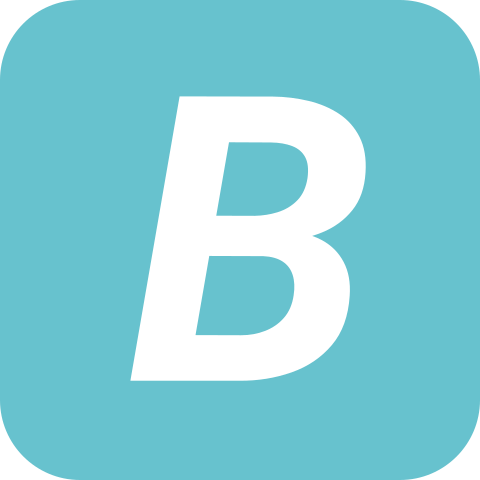

<h1 align="center">
  
  <br>
  <strong><em>Bountee</em></strong>
</h1>
<p align="center">
  <strong><em>Bountee</em></strong> is team TBDJ's 2025 5C Hackathon project.
  <br>
  For more details and a demo see our <a href="https://devpost.com/software/bountee-irv8c1">DevPost</a>.
</p>

## Team

- [Jasmine Liu](https://github.com/jasmineeliu)
- [Angie Tsai](https://github.com/angelinatsai04)
- [Uddant Patodia](https://github.com/uddant)
- [Oliver Howe](https://github.com/ohowe1)

## Initial Setup

Ensure you have Docker and Corepack installed/enabled. Then run:

```bash
yarn install
yarn docker:build
```

Create your `backend/.env.development.local` with the format:

```
GOOGLE_CLIENT_ID=
GOOGLE_CLIENT_SECRET=
PAYPAL_CLIENT_ID=
PAYPAL_CLIENT_SECRET=
```

## Running

To start the frontend, backend, and DB, simply run:

```bash
yarn docker:up
```

Then you can visit `localhost:3000` to view the frontend. The backend is running on `localhost:8080`.
